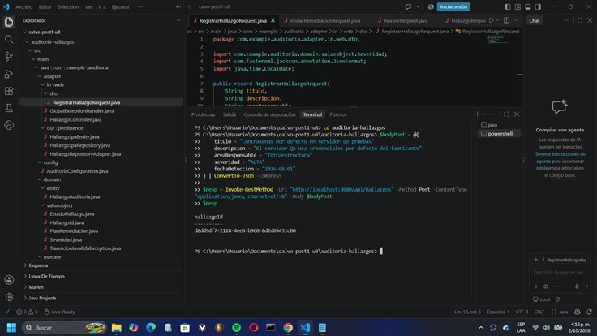
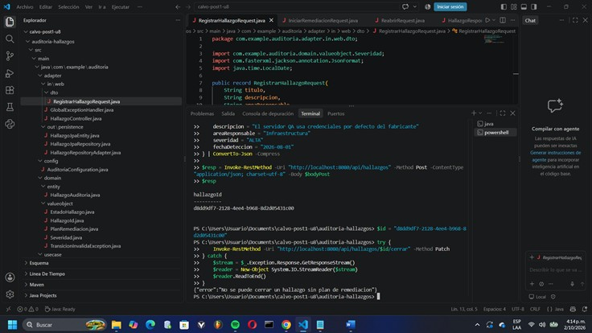
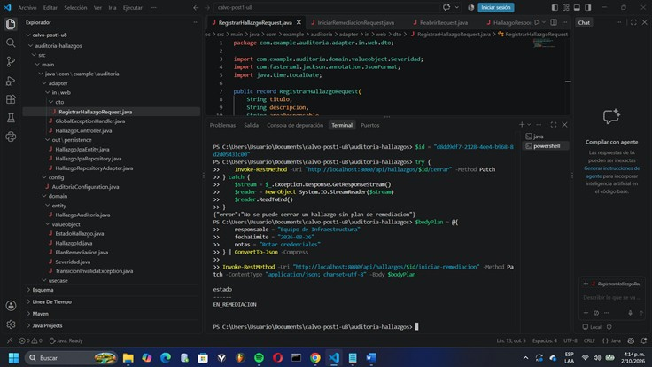
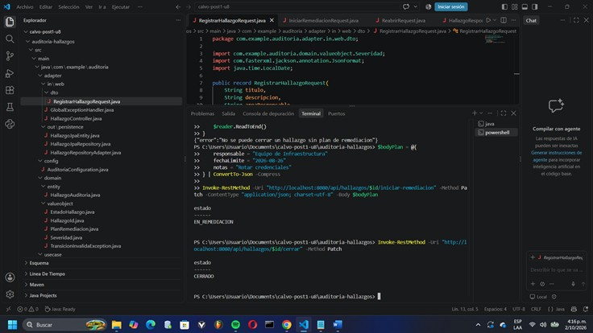
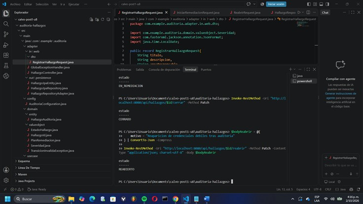
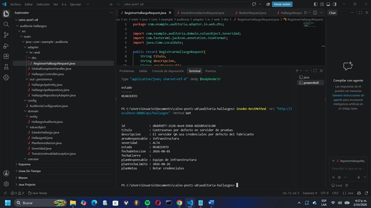
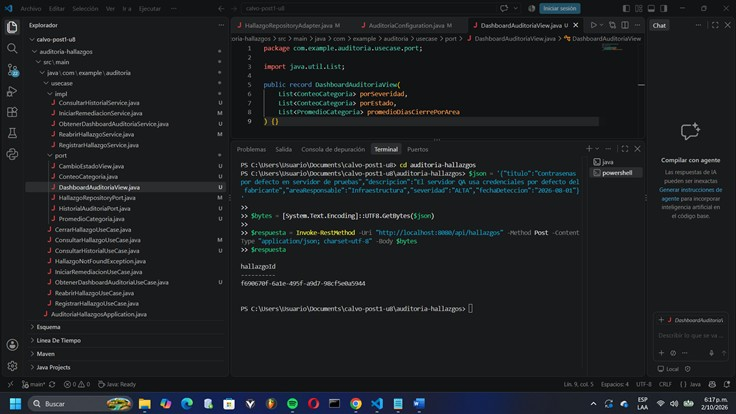
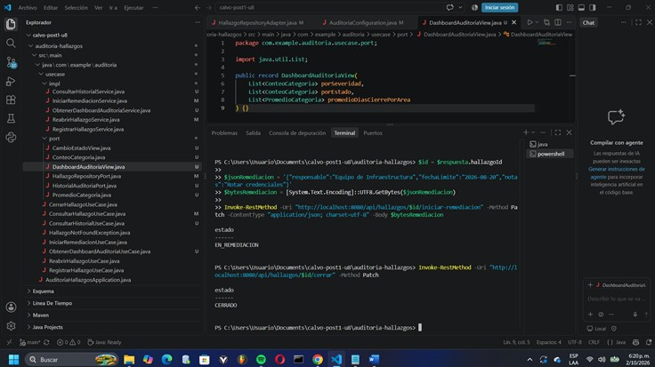
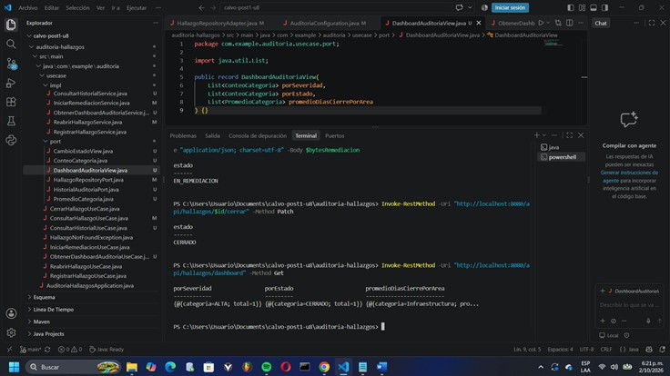
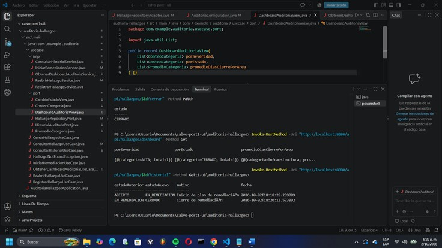

# Post-contenido — Unidad 8: Patrones Arquitectónicos II

## Descripción

Repositorio del post-contenido de la Unidad 8 de Patrones de Diseño de Software — Sexto Semestre. Sistema de seguimiento de hallazgos de auditoría interna implementado con **Clean Architecture** (Parte 1) y extendido con un **dashboard agregado** y una **bitácora de trazabilidad** (Parte 2), sobre el mismo proyecto Spring Boot. La Parte 2 no crea un proyecto paralelo: parte de un análisis costo-beneficio de CQRS/Event Sourcing y solo implementa lo que ese análisis justifica.

---

## Parte 1 — Clean Architecture (Hallazgos de Auditoría)

El proyecto organiza los cuatro círculos concéntricos de Clean Architecture:

| Círculo | Paquete | Contenido |
|---|---|---|
| **Entities** | `domain/` | Aggregate Root `HallazgoAuditoria`; Value Objects `HallazgoId`, `Severidad`, `EstadoHallazgo` (máquina de estados), `PlanRemediacion`; `TransicionInvalidaException`. |
| **Use Cases** | `usecase/` | Interfaces de casos de uso (registrar, iniciar remediación, cerrar, reabrir, consultar, dashboard), puertos en `port/` e implementaciones en `impl/`. |
| **Interface Adapters** | `adapter/` | `in/web/` (`HallazgoController` y DTOs) y `out/persistence/` (`HallazgoJpaEntity`, `HallazgoJpaRepository`, `HallazgoRepositoryAdapter`, adaptador del historial). |
| **Frameworks & Drivers** | Spring Boot + JPA + H2 | Cableado explícito en `config/AuditoriaConfiguration`. |

La dependencia del código siempre apunta hacia adentro, hacia `domain/`. Los paquetes `domain/` y `usecase/` no importan `org.springframework` ni `jakarta.persistence`: la entidad JPA vive solo en `adapter/out/persistence/` y el adaptador traduce campo a campo entre ella y el objeto de dominio. Gracias a esto, `HallazgoAuditoria` puede instanciarse y probarse con JUnit sin `@SpringBootTest`.

### Pruebas  
HallazgoAuditoriaTest verifica con JUnit 5, sin @SpringBootTest, las transiciones válidas, el rechazo de cierre sin plan, el rechazo de reapertura desde ABIERTO, el ciclo completo y la rehidratación del agregado (reconstituir). Se ejecuta con mvn test.

### Estructura de paquetes

```
calvo-post1-u8/
├── pom.xml
├── mvnw / mvnw.cmd
├── README.md
├── docs/                                       ← capturas de los endpoints
└── src/main/
    ├── resources/application.properties
    └── java/com/example/auditoria/
        ├── AuditoriaHallazgosApplication.java
        ├── domain/
        │   ├── entity/
        │   │   └── HallazgoAuditoria.java              ← Aggregate Root
        │   └── valueobject/
        │       ├── HallazgoId.java
        │       ├── Severidad.java                      ← enum simple
        │       ├── EstadoHallazgo.java                 ← enum con máquina de estados
        │       ├── PlanRemediacion.java                ← Value Object inmutable
        │       └── TransicionInvalidaException.java
        ├── usecase/
        │   ├── RegistrarHallazgoUseCase.java
        │   ├── IniciarRemediacionUseCase.java
        │   ├── CerrarHallazgoUseCase.java
        │   ├── ReabrirHallazgoUseCase.java
        │   ├── ConsultarHallazgoUseCase.java
        │   ├── ObtenerDashboardAuditoriaUseCase.java
        │   ├── ConsultarHistorialUseCase.java
        │   ├── HallazgoNotFoundException.java
        │   ├── port/
        │   │   ├── HallazgoRepositoryPort.java         ← extendido en la Parte 2
        │   │   ├── HistorialAuditoriaPort.java
        │   │   ├── ConteoCategoria.java
        │   │   ├── PromedioCategoria.java
        │   │   ├── DashboardAuditoriaView.java
        │   │   └── CambioEstadoView.java
        │   └── impl/
        │       ├── RegistrarHallazgoService.java
        │       ├── IniciarRemediacionService.java
        │       ├── CerrarHallazgoService.java
        │       ├── ReabrirHallazgoService.java
        │       ├── ConsultarHallazgoService.java
        │       ├── ObtenerDashboardAuditoriaService.java
        │       └── ConsultarHistorialService.java
        ├── adapter/
        │   ├── in/web/
        │   │   ├── HallazgoController.java
        │   │   ├── GlobalExceptionHandler.java         ← mapea excepciones a 400/404
        │   │   └── dto/
        │   │       ├── RegistrarHallazgoRequest.java
        │   │       ├── IniciarRemediacionRequest.java
        │   │       ├── ReabrirRequest.java
        │   │       └── HallazgoResponse.java
        │   └── out/persistence/
        │       ├── HallazgoJpaEntity.java
        │       ├── HallazgoJpaRepository.java          ← extendido en la Parte 2
        │       ├── HallazgoRepositoryAdapter.java
        │       ├── HistorialCambioEstadoJpaEntity.java
        │       ├── HistorialCambioEstadoJpaRepository.java
        │       └── HistorialAuditoriaAdapter.java
        └── config/
            └── AuditoriaConfiguration.java             ← wiring explícito
```

### Endpoints

| Método | Ruta | Resultado |
|---|---|---|
| POST | `/api/hallazgos` | 201 + `hallazgoId` (UUID) |
| PATCH | `/api/hallazgos/{id}/iniciar-remediacion` | 200, estado `EN_REMEDIACION` |
| PATCH | `/api/hallazgos/{id}/cerrar` | 200, estado `CERRADO` (400 si la transición es inválida o no hay plan) |
| PATCH | `/api/hallazgos/{id}/reabrir` | 200, estado `REABIERTO` |
| GET | `/api/hallazgos` y `/api/hallazgos/{id}` | Consulta de hallazgos |
| GET | `/api/hallazgos/dashboard` | Conteos por severidad y estado, y promedio de días de cierre por área |
| GET | `/api/hallazgos/{id}/historial` | Cambios de estado en orden cronológico |


## Parte 2 — Análisis costo-beneficio de CQRS/Event Sourcing

**Contexto.** El comité de auditoría plantea dos requisitos: (1) un dashboard consolidado antes de cada reunión mensual (hallazgos por severidad, por estado y promedio de días entre detección y cierre por área) y (2) trazabilidad legal de cada cambio de estado (quién, cuándo, de qué estado a cuál), sin alteración retroactiva. Son el tipo de requisitos con los que la guía introduce CQRS (lecturas con forma distinta a las escrituras) y Event Sourcing (historial completo para auditoría). Antes de escribir código, se aplicaron los criterios de la Sección 7 (y la 4.4 y 5.5) de la guía a la escala real del proyecto.

### 1. Escala y carga

CQRS se justifica cuando lecturas y escrituras tienen cargas tan distintas que necesitan escalar de forma independiente (Sección 4.4). Aquí no ocurre: el sistema es un laboratorio académico con un único desarrollador, cero usuarios concurrentes reales y una base H2 con un volumen de datos de decenas de hallazgos. Las escrituras son transiciones de estado ocasionales y las lecturas son consultas de un comité que se reúne una vez al mes. No hay asimetría medible entre ambas, y por tanto no existe ningún cuello de botella que una infraestructura separada de lectura y escritura venga a resolver. Montar dos stacks para una carga que un solo repositorio absorbe sin esfuerzo sería pagar un costo permanente (más código, más configuración, más puntos de fallo) sin recibir ningún beneficio operativo.

### 2. Complejidad de las consultas

El dashboard pide tres agregaciones: `COUNT ... GROUP BY severidad`, `COUNT ... GROUP BY estado` y `AVG(días entre detección y cierre) ... GROUP BY área` filtrando los hallazgos cerrados. Las tres se resuelven con una consulta JPQL con `GROUP BY` sobre el mismo esquema relacional, ya que `fechaDeteccion`, `fechaCierre`, `severidad`, `estado` y `areaResponsable` están todos en `HallazgoJpaEntity`; el dominio ya registraba `fechaCierre` desde la Parte 1, por lo que no requirió cambios. Un modelo de lectura con tecnología o esquema distinto (otra base de datos, vistas desnormalizadas) solo se justificaría si estas consultas fueran lentas, necesitaran joins entre múltiples agregados o requirieran un índice de búsqueda especializado. Ninguna de esas condiciones se cumple, así que se extendió el puerto existente `HallazgoRepositoryPort` con tres métodos y se implementaron con *interface projections* de Spring Data JPA sobre el mismo `HallazgoJpaRepository`.

### 3. Consistencia

El criterio pregunta si el comité necesita el dashboard en tiempo real o si tolera datos ligeramente desactualizados. En la práctica, un reporte que se consulta antes de una reunión mensual refleja "el estado al momento de la consulta", como cualquier reporte generado bajo demanda. Con la extensión liviana, el dashboard lee directamente la fuente de verdad y es **inmediatamente consistente**: no hay proyecciones, colas ni sincronización. Un CQRS completo con modelos separados introduciría justamente lo contrario: consistencia eventual, con la necesidad de manejar retrasos y fallos de sincronización entre el lado de escritura y el de lectura. Ese costo no compra nada aquí, porque nadie lo necesita y además empeoraría la garantía que hoy se obtiene gratis.

### 4. Naturaleza de la trazabilidad exigida

La pregunta decisiva es si Cumplimiento necesita **reconstruir el estado completo** del hallazgo reproduciendo eventos uno por uno (Event Sourcing, Sección 5.5) o si le basta una **bitácora cronológica** de cambios. El requisito dice textualmente que debe poder reconstruirse "cada cambio de estado: quién lo originó, cuándo y de qué estado a qué estado". Eso es una secuencia de transiciones, no una necesidad de rehidratar el agregado ni de consultar estados intermedios completos. Una tabla append-only (`historial_cambios_estado`) cubre el requisito: solo se inserta, nunca se actualiza ni se elimina (no existe ningún método de actualización o borrado en su puerto ni en su adaptador) y se escribe en la misma transacción que la transición. El Event Sourcing completo aportaría además replay de estados, proyecciones nuevas desde eventos pasados y *time travel*, capacidades que nadie ha pedido, a cambio de reescribir un agregado que ya funciona.

### 5. Señales de sobre-ingeniería (Sección 7.2)

Se evaluaron una a una las cinco señales de la guía:

- **«El 80% del código son mappers y adaptadores, con menos del 20% de lógica de negocio».** Ya hay una traducción campo a campo entre `HallazgoJpaEntity` y `HallazgoAuditoria`. CQRS completo duplicaría esa capa (modelo de comando, modelo de consulta, sincronización) y Event Sourcing sumaría serialización y deserialización de eventos, empujando al proyecto hacia esa proporción.
- **«El equipo pasa más tiempo explicando la arquitectura que entregando funcionalidades».** El equipo es una persona, sin experiencia previa en Event Sourcing; la curva de aprendizaje competiría directamente con la entrega de funcionalidad.
- **«Las pruebas del dominio son más difíciles con la nueva arquitectura».** Hoy `HallazgoAuditoria` se prueba con JUnit puro. Con Event Sourcing habría que probar la aplicación de eventos y la reconstrucción del estado, y la prueba dejaría de ser una simple llamada a `cerrar()`.
- **«No existe un experto de negocio para definir el lenguaje ubicuo».** El comité y Cumplimiento son ficticios en este laboratorio, así que no hay con quién modelar eventos de dominio con la calidad que exige Event Sourcing; los eventos mal modelados son costosos de corregir porque son inmutables.
- **«El sistema no tiene requerimientos de auditoría, ni múltiples modelos de lectura, ni escala diferencial».** Esta es la única señal que **no** se cumple por completo: el sistema sí tiene un requisito de auditoría real. Pero ese requisito es de bitácora, no de reconstrucción de estado, y no hay múltiples modelos de lectura ni escala diferencial. Por eso apunta a una solución puntual y no al patrón completo.

### Conclusión del análisis

**No se justifica adoptar CQRS ni Event Sourcing completos; se implementó la extensión liviana.** Escala, complejidad de consultas, consistencia y señales de sobre-ingeniería apuntan en la misma dirección, y el único criterio con peso real (la trazabilidad) queda cubierto por una bitácora append-only. La solución elegida consiste en (a) tres consultas agregadas añadidas al mismo `HallazgoRepositoryPort`/`HallazgoJpaRepository`, y (b) una tabla `historial_cambios_estado` que coexiste con el estado actual. Esto satisface ambos requisitos con el mínimo de complejidad necesaria y mantiene intacta la pureza de los círculos de Clean Architecture.

---

## Decisiones de diseño

### 1. Severidad como enum simple vs. EstadoHallazgo como enum con máquina de estados

**Decisión:** `EstadoHallazgo` es un enum con comportamiento (`puedeTransicionarA(destino)`); `Severidad` es un enum simple de cuatro valores (`CRITICA`, `ALTA`, `MEDIA`, `BAJA`).

**Justificación:** la diferencia está en si el concepto encapsula una **regla de negocio real**. `EstadoHallazgo` sí: define qué transiciones son válidas (`ABIERTO → EN_REMEDIACION → CERRADO → REABIERTO → EN_REMEDIACION`) y rechaza cualquier otra (por ejemplo, cerrar un hallazgo que nunca estuvo en remediación o reabrir uno que sigue abierto). Ubicar esa regla dentro del propio enum respeta el encapsulamiento de DDD: la regla vive en el objeto que la conoce, el Aggregate Root solo delega en ella desde `transicionar(...)`, y cualquier cambio del ciclo de vida se modifica en un único lugar, con una sola prueba unitaria. `Severidad`, en cambio, es una clasificación estática: ninguna severidad es «más válida» que otra en un momento dado ni condiciona ninguna operación del sistema. Dotarla de métodos (orden, comparaciones, umbrales) sería inventar comportamiento que el negocio no ha pedido, es decir, sobre-diseño. Tampoco habría sido razonable lo contrario (un estado como enum simple), porque entonces la validación de transiciones se dispersaría en `if` dentro de los casos de uso o del agregado, y la regla de negocio quedaría fuera del dominio o duplicada. Si en el futuro la severidad influyera en el negocio (por ejemplo, plazos máximos de remediación según severidad), ese sería el momento de darle comportamiento.

### 2. PlanRemediacion como Value Object embebido vs. agregado separado

**Decisión:** `PlanRemediacion` es un Value Object inmutable (un `record`) embebido en el Aggregate Root `HallazgoAuditoria`, no un agregado independiente con su propio repositorio.

**Justificación:** el criterio determinante es el **límite de consistencia transaccional** de los Agregados (Sección 3.3 de la guía): un agregado debe contener todo lo que debe ser consistente de forma inmediata dentro de una misma transacción. Aquí existen dos invariantes que involucran al plan: un hallazgo **no puede pasar a `EN_REMEDIACION` sin un plan válido** (`iniciarRemediacion(plan)` exige el plan y lo valida) y **no puede cerrarse sin uno ya definido** (`cerrar()` lanza `IllegalStateException` si no existe). Si el plan fuera un agregado separado referenciado por `HallazgoId`, ambas invariantes cruzarían dos agregados y dos repositorios; su cumplimiento dependería de coordinar dos escrituras, abriendo ventanas de inconsistencia (hallazgo en remediación sin plan persistido, o plan huérfano sin hallazgo). Al embeberlo, `HallazgoAuditoria` es el único guardián de las reglas y todo se persiste de forma atómica. Además, el plan cumple las características de un Value Object: no tiene identidad propia (se define por responsable, fecha límite y notas), es inmutable y no tiene ciclo de vida independiente del hallazgo. En persistencia se aplana en tres columnas (`planResponsable`, `planFechaLimite`, `planNotas`), sin tabla ni repositorio adicionales.

### 3. CQRS/Event Sourcing completos vs. extensión liviana del repositorio existente

**Decisión:** se implementó una **extensión liviana**: se ampliaron `HallazgoRepositoryPort` y `HallazgoJpaRepository` (el mismo puerto y el mismo repositorio) con tres consultas agregadas, y no se crearon stacks de comando y consulta separados ni persistencia por eventos.

**Justificación (criterios de la Sección 7 y 4.4 de la guía, desarrollados en el análisis de la Parte 2):**

- **Escala y carga:** un desarrollador, sin usuarios concurrentes reales y sin asimetría entre lecturas y escrituras; no hay nada que escalar por separado.
- **Complejidad de consultas:** los tres indicadores del dashboard son consultas JPQL con `GROUP BY` sobre un único esquema; no requieren otra tecnología ni un modelo desnormalizado.
- **Consistencia:** el comité consulta el dashboard bajo demanda; leer de la fuente de verdad lo hace inmediatamente consistente, mientras que CQRS completo introduciría consistencia eventual sin necesidad.
- **Trazabilidad:** basta con una bitácora cronológica, no se exige reproducir estados (ver decisión 4).
- **Señales de sobre-ingeniería (7.2):** varias están presentes o se agravarían (más mappers, curva de aprendizaje, ausencia de experto de negocio).

Los dos requisitos nuevos se cubren con extensiones puntuales que respetan los círculos de Clean Architecture: el dashboard es un caso de uso (`ObtenerDashboardAuditoriaUseCase`) que depende del puerto existente, y las proyecciones son un detalle del adaptador de persistencia. El costo de la alternativa (dos modelos que mantener sincronizados) no es proporcional al problema. Una conclusión distinta habría exigido una razón concreta y verificable; no la hay hoy, y las condiciones que la crearían se describen en las Conclusiones.

### 4. Bitácora simple (HistorialCambioEstado) vs. Event Store completo

**Decisión:** la trazabilidad se implementa como una **tabla de auditoría append-only** (`historial_cambios_estado`, entidad `HistorialCambioEstadoJpaEntity`) escrita en la **misma transacción** que cada transición de estado, que coexiste con —y no reemplaza a— el estado actual de `HallazgoJpaEntity`, que sigue siendo la única fuente de verdad.

**Justificación (señales de sobre-ingeniería, Sección 7.2):** un Event Store completo obligaría a que `HallazgoAuditoria` dejara de persistir su estado actual y se reconstruyera por *replay* de eventos en cada lectura: un cambio de fondo sobre un agregado que ya funciona, sin una necesidad real de reproducir estados intermedios ni de alimentar proyecciones desconocidas. Frente a las señales de la guía:

1. **Mappers y adaptadores sobre lógica de negocio:** un Event Store añadiría serialización de eventos, versionado y rehidratación, aumentando la parte «de infraestructura» del código frente a la lógica real.
2. **Más tiempo explicando que entregando:** el equipo (una persona) no tiene experiencia previa con Event Sourcing, y su adopción desplazaría la entrega de funcionalidad.
3. **Pruebas de dominio más difíciles:** hoy `HallazgoAuditoria` se prueba con JUnit puro llamando a `cerrar()`; con eventos habría que probar la aplicación de cada evento y la reconstrucción del estado.
4. **Sin experto de negocio:** no hay con quién modelar los eventos de dominio, y los eventos mal definidos son difíciles de corregir porque son inmutables.
5. **Requerimientos de auditoría, modelos de lectura y escala:** sí hay un requisito de auditoría, pero es acotado (mostrar la secuencia de cambios), no hay múltiples modelos de lectura ni escala diferencial.

La bitácora solo necesita mostrar la secuencia de cambios (estado anterior, estado nuevo, motivo y fecha); no necesita ser la fuente de verdad. Es append-only por diseño (`registrar` solo inserta y no existe operación de actualización ni de borrado). Cada registro guarda estado anterior, estado nuevo, motivo, usuario que originó el cambio y fecha. El límite transaccional se declara en el adapter (@Transactional en los @PatchMapping de HallazgoController) para mantener usecase/ libre de Spring: el estado y su registro de auditoría se confirman o se revierten juntos. El usuario se toma del header X-Usuario (por defecto sistema); es una simplificación académica, ya que un sistema real lo obtendría del principal autenticado.

---

## Cómo ejecutar

```
$ mvn clean package
$ mvn spring-boot:run
```

La aplicación queda en `http://localhost:8080`. Pruebas rápidas:

```
# Registrar un hallazgo
curl -X POST http://localhost:8080/api/hallazgos -H "Content-Type: application/json" \
  -d '{"titulo":"Contraseñas por defecto en servidor de pruebas","descripcion":"El servidor QA usa credenciales por defecto","areaResponsable":"Infraestructura","severidad":"ALTA","fechaDeteccion":"2026-08-01"}'

# Dashboard e historial
curl http://localhost:8080/api/hallazgos/dashboard
curl http://localhost:8080/api/hallazgos/{id}/historial
```

## Herramientas utilizadas

- Java 17, Spring Boot 3.x, Spring Data JPA, H2
- Apache Maven, Postman/curl, Git, GitHub

## Conclusiones

La Parte 1 mostró que Clean Architecture mantiene las reglas de negocio (la máquina de estados y las invariantes del plan de remediación) aisladas de Spring y JPA, lo que permite probarlas sin framework y cambiar la persistencia sin tocar el dominio. La Parte 2 mostró que un requisito que *parece* pedir CQRS o Event Sourcing no necesariamente los justifica: aplicando los criterios de escala, complejidad de consultas, consistencia, trazabilidad y señales de sobre-ingeniería, bastaron consultas agregadas sobre el mismo repositorio y una bitácora append-only. Reconsideraría esta decisión si el sistema creciera hasta tener muchos usuarios concurrentes con una asimetría clara entre lecturas y escrituras, si el dashboard se volviera lento sobre grandes volúmenes o necesitara múltiples modelos de lectura distintos, si Cumplimiento exigiera reconstruir estados pasados completos o garantías de inalterabilidad más fuertes que una tabla append-only (por ejemplo, registros encadenados con hash), o si existieran un experto de negocio y un equipo con experiencia para modelar eventos. Mientras esas condiciones no existan, la solución más simple que cumple los requisitos es también la más correcta.

## Capturas de pantalla

### Petición en PowerShell especificando UTF-8


### Intentar Cerrar SIN remediación (Prueba de Invariante de Dominio - Espera error HTTP 400)



### Iniciar Remediación (PATCH /api/hallazgos/{id}/iniciar-remediacion)



### Cerrar Hallazgo (PATCH /api/hallazgos/{id}/cerrar)



### Reabrir Hallazgo (PATCH /api/hallazgos/{id}/reabrir)



### Consultar todos los hallazgos (GET /api/hallazgos)



## Parte 2

### Registrar un hallazgo



### Iniciar remediación


### Cerrar el hallazgo



### Consultar el Dashboard



### Consultar el Historial Cronológico



